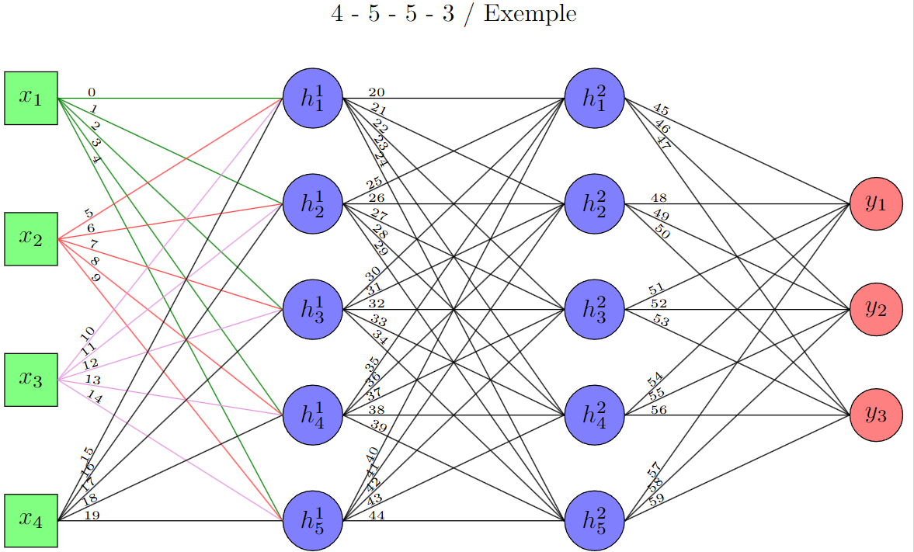

<p align="center">
    
    
    
    <br/>
    
    
    <br/>
    

</p>

# Neural Network Diagram Generator
This LaTeX script generates a detailed diagram of a neural network (MLP) using the `tikz` package. The diagram includes input neurons, hidden layers, and output neurons, with customizable styles for different types of weights.

## Features
- Customizable Network Architecture: Define the number of neurons in each layer.
- Weight Visualization: Display positive, negative, and false negative weights with different styles.
- Index Display Option: Toggle the display of index numbers on the weights.
- Automatic Layout: Neurons and connections are automatically positioned for clarity.

## Usage
1. **Define Network Architecture**: Modify the `\networkShape` variable to set the number of neurons in each layer.
    ```latex
    \def\networkShape{4,5,5,3}
    ```

2. **Customize Weights Signs**: Update the `\positiveWeights`, `\negativeWeights`, and `\falseNegativeWeights` variables to specify the sign of each weight.
    ```latex
    \def\positiveWeights{}
    \def\negativeWeights{}
    \def\falseNegativeWeights{}
    ```
    All weights not considered in these arrays will be classified as *unsigned*.

3. **Customize Weights Values**: Update the `\weightValues` variable to specify the value of each weight.
    ```latex
    \def\weightValues{}
    ```
    In the diagram, you can uncomment different lines and after `\index` when displaying the index of each weight, you can add `\getValue` to display the index and the value of each weight.
    ```latex
    \pgfmathsetmacro{\getValue}{{\weightValues}[\index]}
    ```

4. **Toggle Index Display**: Set `\displayIndex` to `1` to display index numbers on the weights, or `0` to hide them.
    ```latex
    \pgfmathsetmacro{\displayIndex}{0}
    ```

5. **Update the Title of the Diagram**: At the end of the script, you can modify the title of the diagram.
    ```latex
    \pgfmathsetmacro{\nbLayers}{int(\numLayers)}
    \def\networkText{}
    \foreach \i in {0,...,\nbLayers} {
        \pgfmathparse{{\networkShape}[\i]}
        \xdef\networkText{\networkText\pgfmathresult}
        \ifnum\i<\nbLayers
            \xdef\networkText{\networkText~- }
        \fi
    }
    \node (text) at ($(current bounding box.north) + (0,.75)$) {%
        \networkText~/ Example
    };
    ```
    These lines display as title the shape of the diagram separated by a hyphen, followed by `/ Example`. You can modify these lines to update or comment these lines and uncomment the commented lines to only show one line of text where you can write what you want.

6. **Compile the Document**: Use a LaTeX editor that supports the `tikz` package to compile the document and generate the diagram.
    ```bash
    pdflatex neural_network.tex
    ```

## Example
The following example defines a neural network with 4 input neurons, 5 neurons in the first hidden layer, 5 neurons in the second hidden layer, and 3 output neurons.

```latex
% Define the network architecture as an array
% Each element represents the number of neurons in that layer
\def\networkShape{4,5,5,3}

% Weights signs
\def\positiveWeights{0,1,2,3,4}
\def\negativeWeights{5,6,7,8,9}
\def\falseNegativeWeights{10,11,12,13,14}

% Values of all model weights
\def\weightValues{}

% Display the index number or not (0 no / 1 yes)
\pgfmathsetmacro{\displayIndex}{1}
```



## Additional Information
- **Standalone page**: The document use a `tikzpicture` in a `standalonepage` environment. This environment allows to define multiple `tikzpicture` in the same PDF file. You only need to copy/paste the existing environment to add another `tikzpicture`.

## Contact Information
- **Author**: William PENSEC
- **Website**: <a href="https://pensec.fr">pensec.fr</a>
- **Date**: April 2025

## Citation

- **GitHub citation**
```bibtex
@online{generatorMLPDiagram,
  author = {William PENSEC},
  title = {{Neural Network Diagram Generator}},
  year = 2025,
  url = {https://github.com/WilliamPsc/generatorNeuralNetworkTikz}
}
```